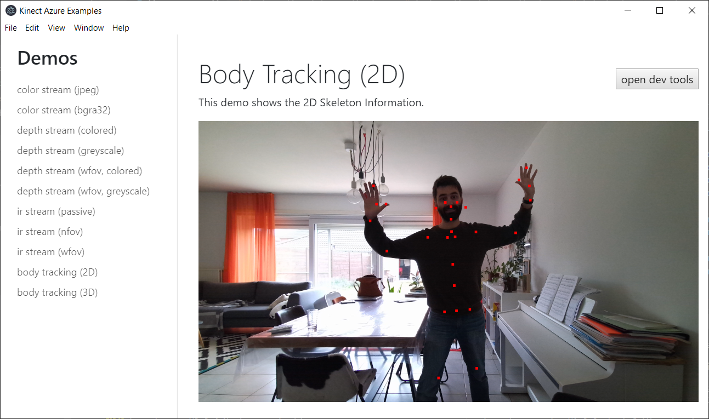

# Azure Kinect Library for Node / Electron

[](https://www.paypal.com/cgi-bin/webscr?cmd=_donations&business=NUZP3U3QZEQV2&currency_code=EUR&source=url)

This library enables you to use the Azure Kinect in your nodejs or electron apps on Windows and Linux.



Features:

- get rgb camera feed
- get depth feed
- get ir feed
- transform between color and depth feed
- point cloud (greyscale and colored)
- get skeleton joints (2d and 3d)
- body index / user masking
- get temperature / accelerometer / gyroscope data (IMU data)

Check out [my kinect2 library](https://github.com/wouterverweirder/kinect2) for the Kinect v2 sensor.

## Installation

Make sure you have the Azure Kinect drivers and the [Azure Kinect Body SDK](https://docs.microsoft.com/en-us/azure/kinect-dk/body-sdk-download) installed.

The current version of this library links to:
- Azure Kinect Sensor SDK v1.4.1
- Azure Kinect Body Tracking SDK v1.1.0

On Windows, The Body Tracking SDK relies on quite a few dll & onnx files, which you can find in the `Azure Kinect Body SDK\tools` directory. Either add that folder (eg C:\Program Files\Azure Kinect Body Tracking SDK\tools) to your PATH or copy the dll and onnx files into the root of your project.

Just npm install like you would do with any regular module. 

```
$ npm install kinect-azure
```

### Potential issues

#### Error: The specified module could not be found

This module relies on some dll & onnx files from the kinect azure installation. If those files can't be loaded, loading the module will fail as well. You can can find those in the `Azure Kinect Body SDK\tools` directory. Either add that folder (eg C:\Program Files\Azure Kinect Body Tracking SDK\tools) to your PATH or copy the dll and onnx files into the root of your project.

#### MSBuild.exe ENOENT

You might run into the error below when trying to install this module:

> Error: spawn C:\Program Files (x86)\Microsoft Visual Studio\2019\BuildTools\MSBuild\15.0\Bin\MSBuild.exe ENOENT

To fix this, make sure to install the latest version of node-gyp globally:

```
$ npm install -g node-gyp
```

## Examples

There are nodejs and electron examples in the examples/ folder of this repo. To run them, execute npm install and npm start:

```
$ cd examples/electron
$ npm install
$ npm start
```

The electron examples have the javascript code inside the html files. You can find these html files in [examples/electron/renderer/demos](examples/electron/renderer/demos).

## Donate

Like this library? Always welcome to buy me a beer 🍺

[](https://www.paypal.com/cgi-bin/webscr?cmd=_donations&business=NUZP3U3QZEQV2&currency_code=EUR&source=url)
