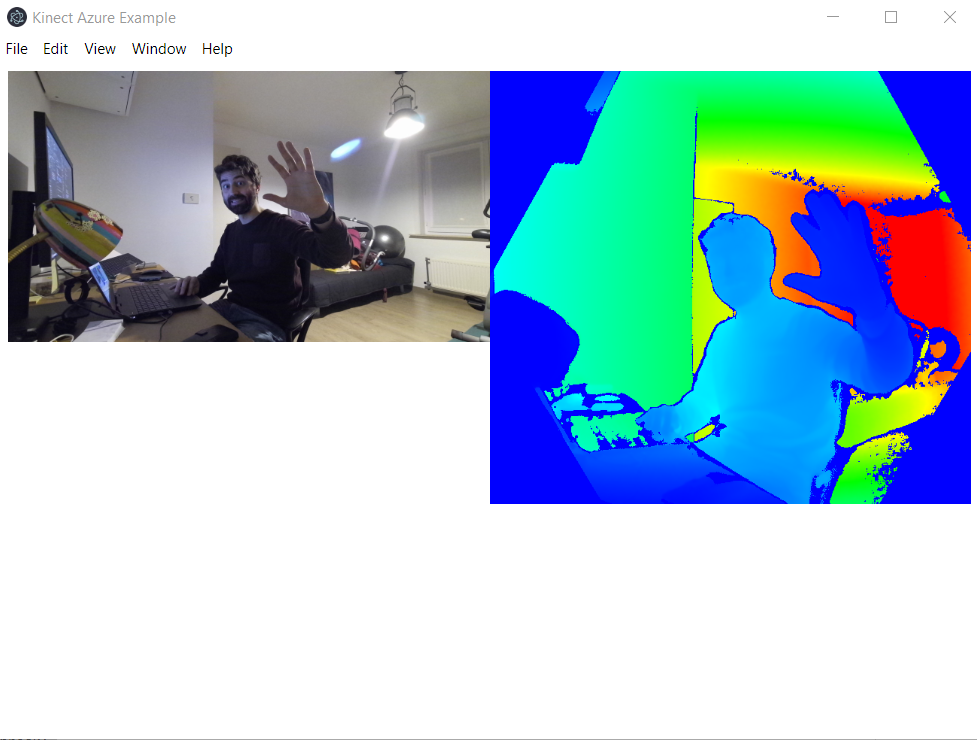

# Azure Kinect Library for Node / Electron

This library enables you to use the Azure Kinect in your nodejs or electron apps.



Features:

- get rgb camera feed
- get depth feed
- get skeleton joints (3d)

Coming later:

- map skeleton joints to 2d space
- user masking
- point cloud

## Installation

Make sure you have the Azure Kinect drivers installed.

Just npm install like you would do with any regular module. 

```
$ npm install kinect-azure
```

There are no precompiled binaries yet, so you need to have [node-gyp installed on your system](https://github.com/nodejs/node-gyp).

### Potential issues

You might run into the error below when trying to install this module:

> Error: spawn C:\Program Files (x86)\Microsoft Visual Studio\2019\BuildTools\MSBuild\15.0\Bin\MSBuild.exe ENOENT

To fix this, make sure to install the latest version of node-gyp globally:

```
$ npm install -g node-gyp
```

### Body tracking

If you want to use body tracking, you will need to have a couple of dll files in the root of your application. Otherwise, you'll run into errors like the one below:

> Cannot locate onnxruntime.dll

The install script of this module tries copy these files automatically. You should have the following files in your application root after running npm install:

- onnxruntime.dll
- dnn_model_2_0.onnx
- cublas64_100.dll
- cudart64_100.dll
- vcomp140.dll
- cudnn64_7.dll

If you can't find these files, copy them from inside node_modules/kinect-azure to your project root.

## Examples

There are nodejs and electron examples in the examples/ folder of this repo. To run them, execute npm install and npm start:

```
$ cd examples/electron
$ npm install
$ npm start
```

The electron examples have the javascript code inside the html files. You can find these html files in [examples/electron/renderer/demos](examples/electron/renderer/demos).